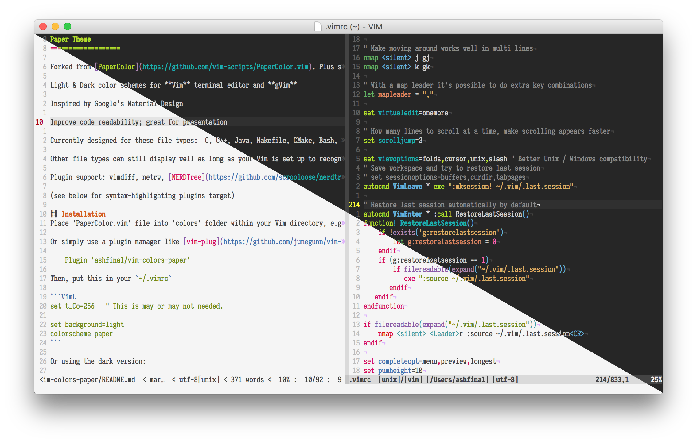

## Paper Theme

Forked from [PaperColor](https://github.com/vim-scripts/PaperColor.vim). Plus some modification of my own.

Light & Dark color schemes for **Vim** terminal editor and **gVim**

Inspired by Google's Material Design

Improve code readability; great for presentation

## Screenshots

**Light & Dark Colorscheme**



###

**Airine Support**


## Installation

Place 'paper.vim' file into 'colors' folder within your Vim directory, e.g. `~/.vim/colors/`

Or simply use a plugin manager like [vim-plug](https://github.com/junegunn/vim-plug) (recommended for easy `:PlugInstall`):

    Plug 'ashfinal/vim-colors-paper'

Then, put this in your `~/.vimrc`

```VimL
set t_Co=256   " This is may or may not needed.

set background=light
colorscheme paper
```

Or using the dark version:

```VimL
set background=dark
colorscheme paper
```

To switch to dark or light variant during session: `:set background=dark` or `:set background=light`

